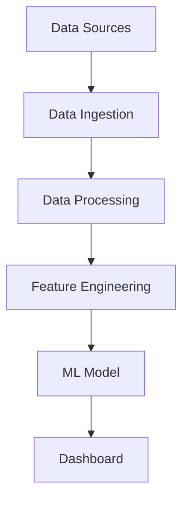

# Data Senior Analytics

[Versao em Portugues](README.md)

[](https://github.com/samuelmaia-data-analyst/data-senior-analytics/actions/workflows/ci.yml)
[](https://codecov.io/gh/samuelmaia-data-analyst/data-senior-analytics)
[](LICENSE)
[](https://www.python.org/downloads/)

Business-focused analytics project that turns raw tabular files into decision-ready insights with a reproducible pipeline and interactive dashboard.

Live demo: https://data-analytics-sr.streamlit.app

## Executive Summary
- Problem: teams depend on slow spreadsheet workflows and non-standard analysis quality.
- Approach: layered pipeline (`raw -> bronze -> silver -> gold`) with ingestion, transformation, EDA, and dashboard delivery.
- Results: CI-gated analytics repo with data governance, output contracts, and reproducible execution.

## Impact
- Metrics: CI automation enforces lint + format + tests + coverage (`>=70%`) on every PR.
- Assumptions: input is CSV/XLSX from business users, with mixed quality and partial missing values.
- Outcomes: faster insight turnaround with stable output schema for dashboard and stakeholder consumption.

## Business Impact
- Simulated scenario (assumptions): 2,400 active customers, 18% annual churn, and BRL 3,200 average annual revenue per customer.
- Potential churn reduction: 2.5 p.p. (from 18.0% to 15.5%), equivalent to 60 customers retained per year.
- Estimated revenue protection: BRL 192,000 per year (60 customers x BRL 3,200).
- Estimated customer lifetime value (CLV) uplift: +9% with risk-segmented retention actions.

## Dataset Description
- Source:
  - `data/sample/default_demo.csv` (quick smoke-test dataset)
  - `data/sample/sample_large.csv` (more realistic demo dataset for exploration)
- Rows:
  - `default_demo.csv`: 12
  - `sample_large.csv`: 240
- Columns: 9
- Key variables: `cliente_id`, `valor_total`, `quantidade`, `preco_unitario`, `desconto`, `categoria`, `regiao`
- How to use in the dashboard:
  - the app auto-loads `default_demo.csv`
  - for more robust analysis, upload `data/sample/sample_large.csv` in the Upload page

## Screenshots / Demo


## Architecture Diagram


## Architecture Proof
- Layered architecture and flow: [docs/ARCHITECTURE.md](docs/ARCHITECTURE.md)
- Architecture decision record (ADR): [docs/adr/0001-architecture-decision.md](docs/adr/0001-architecture-decision.md)
- Data contract (`raw/bronze/silver/gold`): [docs/DATA_CONTRACT.md](docs/DATA_CONTRACT.md)
- Data provenance: [docs/DATA_PROVENANCE.md](docs/DATA_PROVENANCE.md)
- Data lineage manifest: [docs/DATA_LINEAGE.md](docs/DATA_LINEAGE.md)

## Business Recommendations
- Prioritize customers with high churn probability
- Deploy retention campaigns
- Monitor churn drivers monthly

## Decision Playbook
| Decision | Dashboard signal | When to act | Recommended action |
|---|---|---|---|
| Regional retention push | estimated regional churn above baseline | If one region stays >20% for 2 weeks | Launch local tactical retention campaign and review service quality |
| Discount repricing | average discount rises while `valor_total` stalls | If average discount >10% for 2 monthly cycles | Recalibrate pricing policy and cap discounts outside strategic segments |
| Portfolio prioritization | category-level revenue decline | If one category drops >8% for 3 months | Adjust product mix, bundles, and cross-sell motions |
| Data quality escalation | nulls/duplicates rise in uploaded data | If nulls >3% or duplicates >1% | Hold executive reporting and trigger data-owner remediation |
| Concentration risk mitigation | revenue too concentrated in few accounts | If top 10 customers >35% of revenue | Execute account diversification and key-account protection plan |

## Future Improvements
- model drift detection
- automated retraining
- feature store integration

## Reproducible Run
```bash
git clone https://github.com/samuelmaia-data-analyst/data-senior-analytics.git
cd data-senior-analytics
python -m venv .venv
# Linux/macOS
source .venv/bin/activate
# Windows PowerShell
.venv\Scripts\Activate.ps1

make setup
make lint
make test
make run
```

## Environment Variables
Copy `.env.example` to `.env` and adjust values for your environment.

| Variable | Required | Purpose |
|---|---|---|
| `AWS_ACCESS_KEY_ID` | No | Optional AWS integration |
| `AWS_SECRET_ACCESS_KEY` | No | Optional AWS integration |
| `AWS_REGION` | No | AWS region (default: `us-east-1`) |
| `S3_BUCKET_NAME` | No | Bucket used for external persistence |
| `DATA_PATH` | No | Local data root |
| `LOG_LEVEL` | No | Application logging level |

## Quality and Engineering
- `pytest-cov` with coverage gate (`>=70%`)
- `ruff` + `black` + optional `mypy` via pre-commit
- Secret scanning and manifest drift checks in CI
- Gold output contract tests under `tests/`

## Release Management
- Changelog: [CHANGELOG.md](CHANGELOG.md)
- Release notes: see [CHANGELOG.md](CHANGELOG.md).

## License
Licensed under MIT. See [LICENSE](LICENSE).
