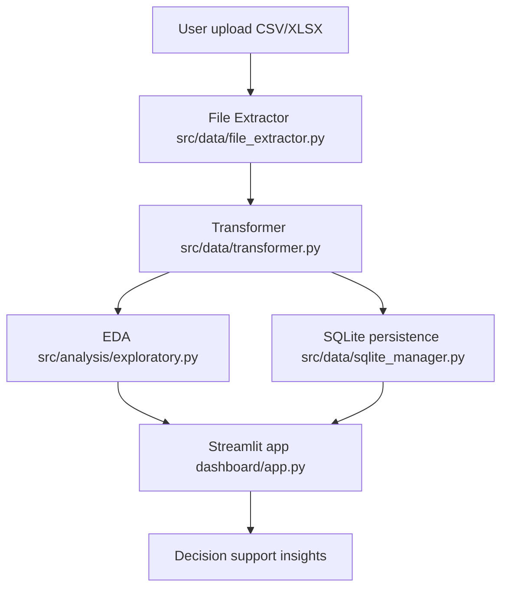
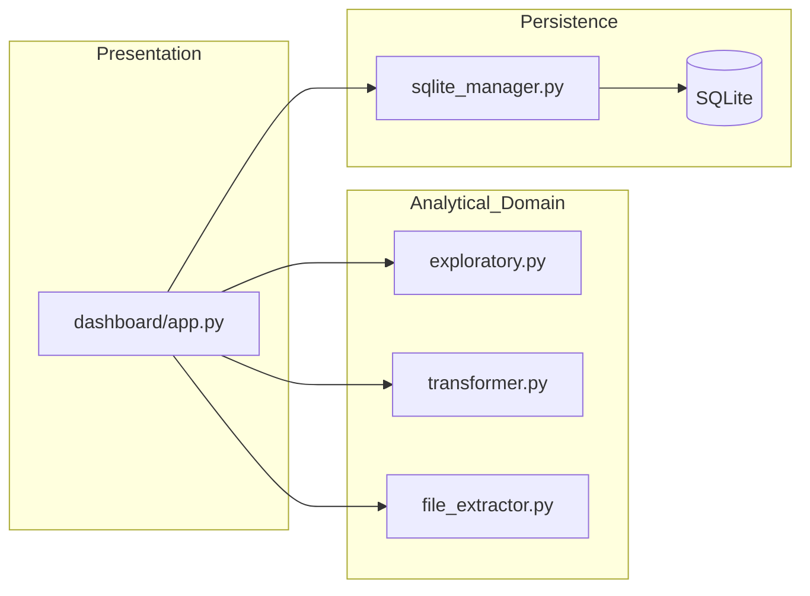

# Data Senior Analytics

[Versão em Português (PT-BR)](README.md)


Business-oriented analytics application that transforms raw tabular data into actionable insights through exploratory analysis, statistical testing, and an interactive dashboard.

Live demo: https://data-analytics-sr.streamlit.app

## Summary
- [Executive Summary](#executive-summary)
- [Data Governance (Kaggle)](#data-governance-kaggle)
- [Business Problem](#business-problem)
- [Data Strategy](#data-strategy)
- [Architecture Overview](#architecture-overview)
- [Detailed Architecture and ADRs](#detailed-architecture-and-adrs)
- [Project Structure](#project-structure)
- [Tech Stack](#tech-stack)
- [Reproducibility (How to Run)](#reproducibility-how-to-run)
- [Streamlit Cloud Deployment](#streamlit-cloud-deployment)
- [Executive Quality Standards](#executive-quality-standards)
- [Contact](#contact)
- [License](#license)

## Executive Summary
This project delivers an end-to-end senior-level analytics workflow: data ingestion, quality diagnostics, exploratory analysis, statistical validation, and insight communication.

It was designed so recruiters and technical leaders can quickly evaluate skills in:
- Business-oriented data analysis
- Analytics engineering and software quality
- Value delivery through an interactive analytical product

## Data Governance (Kaggle)
- Official analytical dataset source: **Kaggle (real dataset)**
- Raw data is not versioned in Git (`data/raw/*` is ignored)
- `*_exemplo.csv` files are synthetic and intended only for local demo
- Mandatory provenance records:
  - [docs/DATA_PROVENANCE.md](docs/DATA_PROVENANCE.md)
  - [config/data_source.yaml](config/data_source.yaml)

## Business Problem
Business teams often rely on spreadsheets and manual analyses, resulting in:
- Low speed for generating insights
- Inconsistent analytical quality
- Low decision traceability

The solution provides a reusable analytics layer where stakeholders upload data and quickly obtain quality diagnostics, patterns, relationships, and trends.

## Data Strategy
### Data Sources
- Primary source: real Kaggle dataset (registered in `docs/DATA_PROVENANCE.md`)
- Input formats: `.csv`, `.xlsx`

### Processing and Analytical Modeling
- Extraction with encoding handling for robust ingestion
- Automatic detection of column types (numeric, categorical, date, id)
- Missing values and outlier diagnostics
- Descriptive statistics and correlation analysis
- Hypothesis testing (t-test, ANOVA, chi-square, Pearson, Spearman)
- Optional SQLite persistence for reproducibility and reuse

## Architecture Overview




## Detailed Architecture and ADRs
- Full technical architecture: [docs/ARCHITECTURE.md](docs/ARCHITECTURE.md)
- Architecture Decision Records:
  - [ADR-0001-streamlit-presentation-layer.md](docs/DECISIONS/ADR-0001-streamlit-presentation-layer.md)
  - [ADR-0002-sqlite-persistence.md](docs/DECISIONS/ADR-0002-sqlite-persistence.md)
  - [ADR-0003-kaggle-provenance-gate.md](docs/DECISIONS/ADR-0003-kaggle-provenance-gate.md)

## Project Structure
```text
.
|-- .streamlit/
|   |-- config.toml
|   `-- secrets.example.toml
|-- dashboard/
|   |-- app.py
|   |-- __init__.py
|   `-- utils/
|       |-- analytics.py
|       `-- __init__.py
|-- src/
|   |-- analysis/
|   |   `-- exploratory.py
|   `-- data/
|       |-- file_extractor.py
|       |-- transformer.py
|       `-- sqlite_manager.py
|-- src/utils/
|   `-- observability.py
|-- config/
|   |-- config.yaml
|   |-- data_source.yaml
|   `-- settings.py
|-- scripts/
|   |-- automation.py
|   |-- check_encoding.py
|   |-- generate_sample_data.py
|   |-- set_kaggle_provenance.py
|   |-- streamlit_cloud_preflight.py
|   `-- validate_data_provenance.py
|-- docs/
|   |-- ARCHITECTURE.md
|   |-- DATA_PROVENANCE.md
|   |-- STREAMLIT_CLOUD.md
|   `-- DECISIONS/
|       |-- ADR-0001-streamlit-presentation-layer.md
|       |-- ADR-0002-sqlite-persistence.md
|       `-- ADR-0003-kaggle-provenance-gate.md
|-- data/
|   `-- sample/default_demo.csv
|-- tests/
|-- requirements.txt
|-- requirements-dev.txt
|-- runtime.txt
|-- pyproject.toml
|-- Makefile
|-- README.md
`-- README.en.md
```

## Tech Stack
- Language: Python
- Application framework: Streamlit
- Data processing: Pandas, NumPy
- Statistics: SciPy
- Visualization: Plotly
- Persistence: SQLite
- Configuration: YAML + Python settings layer

## Reproducibility (How to Run)
### Prerequisites
- Python 3.11+
- pip

### Local Run
```bash
git clone https://github.com/samuelmaia-data-analyst/data-senior-analytics.git
cd data-senior-analytics

python -m venv .venv
# Linux/macOS
source .venv/bin/activate
# Windows PowerShell
.venv\Scripts\Activate.ps1

pip install --upgrade pip
pip install -r requirements-dev.txt

# optional: generate synthetic local dataset for demo
python scripts/generate_sample_data.py

streamlit run dashboard/app.py
```

Local URL: http://localhost:8501

## Streamlit Cloud Deployment
### Recommended setup
- Main file path: `dashboard/app.py`
- Python runtime: `runtime.txt`
- Production dependencies: `requirements.txt`
- Secrets: configure in Streamlit Cloud dashboard based on `.streamlit/secrets.example.toml`

### Runbook
- [docs/STREAMLIT_CLOUD.md](docs/STREAMLIT_CLOUD.md)

## Executive Quality Standards
Operational shortcut (`make`):
```bash
make quality
```

Individual checks:
```bash
python -m ruff check src config scripts dashboard tests
python -m pytest
python scripts/check_encoding.py
python scripts/streamlit_cloud_preflight.py
python scripts/validate_data_provenance.py
```

## Contact
Samuel Maia

Senior Data Analyst

LinkedIn: https://linkedin.com/in/samuelmaia-data-analyst

GitHub: https://github.com/samuelmaia-data-analyst

Email: smaia2@gmail.com

## License
This project is licensed under the MIT License.
