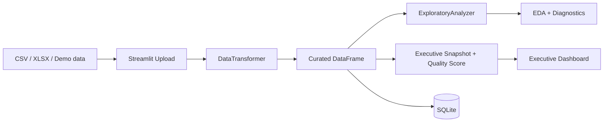

# Data Senior Analytics

[Versao em Portugues](README.md)

[](https://github.com/samuelmaia-analytics/data-senior-analytics/actions/workflows/ci.yml)
[](https://codecov.io/gh/samuelmaia-analytics/data-senior-analytics)
[](LICENSE)
[](https://www.python.org/downloads/)

Analytics project built as a senior-level engineering portfolio piece: a Streamlit dashboard that goes beyond charts and orchestrates automated curation, profiling, executive signals, SQLite persistence, and deployment governance.

Live demo: https://data-analytics-sr.streamlit.app

## Project Thesis
The real problem is not just data visualization. The real problem is converting heterogeneous tabular files into a trustworthy decision workflow, with explicit quality signals, transformation traceability, and reproducible operations.

This repository solves that through a layered approach:
- raw intake via CSV/XLSX or demo datasets
- automated curation with standardization, dtype inference, null handling, and deduplication
- versioned scoring and action policy in `config/dashboard_policy.json`
- executive consumption through KPI, quality readiness, trends, and priority actions
- persistence of curated datasets into SQLite
- engineering discipline with lint, tests, coverage, deploy preflight, and operational documentation

## Why this project signals seniority
- It translates technical data risk into business language: `Quality Score`, `Completeness`, `Priority actions`.
- It treats Streamlit as a product and operations surface, not as a notebook with widgets.
- It separates concerns across `dashboard/`, `src/analysis/`, `src/data/`, and `config/`.
- It extracts curation into a reusable service in `src/app/curation_service.py`.
- It keeps Streamlit Cloud deployment reproducible with a runbook and troubleshooting guidance.
- It protects behavior with automated tests and CI gates.

## What the dashboard delivers
- `Overview`: executive briefing with commercial KPI, top category, top region, revenue trend, and quality status.
- `Upload`: ingestion with automated curation and immediate quality scoring.
- `Data`: raw vs curated comparison, column profile, and transformation log.
- `EDA`: automated insights, statistics, correlation, and missing profile.
- `Visualizations`: distribution, business mix, and trend analysis.
- `Database`: operational verification of the curated dataset persisted in SQLite.
- `Settings`: runtime metadata, quality metadata, and transformation count.

## End-to-end flow
1. The user uploads CSV/XLSX or loads a demo dataset.
2. The app applies `DataTransformer` to build a curated version.
3. `ExploratoryAnalyzer` produces statistics and automated insights.
4. `dashboard/utils/analytics.py` converts profiling into an executive narrative.
5. The user can persist the curated dataset into SQLite.

## Architecture Decisions


Related documentation:
- [docs/ARCHITECTURE.md](docs/ARCHITECTURE.md)
- [docs/STREAMLIT_CLOUD.md](docs/STREAMLIT_CLOUD.md)
- [docs/DATA_CONTRACT.md](docs/DATA_CONTRACT.md)
- [docs/DATA_LINEAGE.md](docs/DATA_LINEAGE.md)
- [docs/DATA_PROVENANCE.md](docs/DATA_PROVENANCE.md)

## Screenshots / Demo


## Stack
- `streamlit` for the executive experience
- `pandas` and `numpy` for transformation and profiling
- `plotly` for analytical visualization
- `sqlite3` via `SQLiteManager` for persistence
- `ruff`, `black`, `pytest`, and `pytest-cov` for engineering discipline

## Local run
```bash
git clone https://github.com/samuelmaia-analytics/data-senior-analytics.git
cd data-senior-analytics
python -m venv .venv

# Linux/macOS
source .venv/bin/activate

# Windows PowerShell
.venv\Scripts\Activate.ps1

pip install -r requirements-dev.txt
python -m streamlit run dashboard/app.py
```

## Quality and operations
- CI with lint, format, tests, and coverage.
- Coverage gate at `>=70%`.
- Streamlit Cloud preflight checks.
- Encoding, provenance, and data manifest validation.
- Deployment runtime aligned on `Python 3.11`.

## Repository structure
- `dashboard/`: Streamlit interface and executive utilities
- `src/analysis/`: automated exploratory analysis
- `src/data/`: curation, ingestion, and persistence
- `config/`: paths and runtime metadata
- `docs/`: architecture, deployment, and governance
- `tests/`: automated behavior protection

## License
Licensed under MIT. See [LICENSE](LICENSE).
