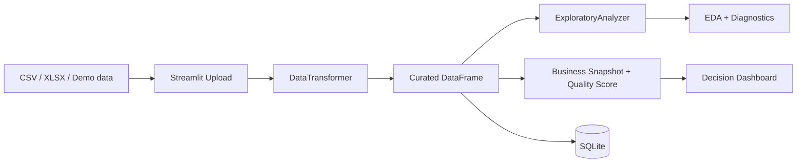

# Data Senior Analytics

[English version](README.en.md)

[](https://github.com/samuelmaia-analytics/data-senior-analytics/actions/workflows/ci.yml)
[](https://www.python.org/downloads/)
[](https://data-analytics-sr.streamlit.app)
[](LICENSE)

Projeto de analytics que transforma arquivos tabulares em um fluxo curado, rastreável e pronto para tomada de decisão, com dashboard Streamlit, persistência em SQLite e governança de deploy.

Demo online: https://data-analytics-sr.streamlit.app

## Tese do Projeto
O problema não é apenas visualizar dados. O problema real é transformar arquivos tabulares heterogêneos em uma experiência confiável para decisão, com qualidade explícita, trilha de transformação e operação reproduzível.

Este repositório resolve isso com uma abordagem em camadas:
- entrada bruta via CSV/XLSX ou datasets demo
- curadoria automática com padronização, inferência de tipos, tratamento de nulos e deduplicação
- política versionada de scoring e ações em `config/dashboard_policy.json`
- leitura de negócio com KPI, qualidade da base, tendências e ações prioritárias
- persistência do dataset curado em SQLite
- disciplina de engenharia com lint, testes, cobertura, preflight de deploy e rastreabilidade

## Sinais de Maturidade
- Traduz risco técnico em linguagem de negócio: `Quality Score`, `Completeness`, `Priority actions`.
- Trata Streamlit como camada de produto e operação, não como notebook com widgets.
- Separa responsabilidades entre `dashboard/`, `src/analysis/`, `src/data/` e `config/`.
- Extrai a curadoria para um serviço reutilizável em `src/app/curation_service.py`.
- Mantém deploy reproduzível em Streamlit Cloud com runbook e troubleshooting documentado.
- Usa testes e gates de CI para proteger comportamento e contratos de saída.

## O que o dashboard entrega
- `Overview`: resumo com KPI comerciais, top category, top region, trend de receita e status de qualidade.
- `Upload`: ingestão com curadoria automática e score de qualidade imediatamente após a carga.
- `Data`: visão lado a lado de bruto vs. curado, perfil de colunas e log do pipeline aplicado.
- `EDA`: insights automatizados, estatísticas, correlação e perfil de valores ausentes.
- `Visualizations`: distribuição, mistura de negócio e análise de tendência.
- `Database`: verificação operacional do dataset persistido no SQLite.
- `Settings`: metadados de runtime, qualidade e transformações aplicadas.

## Fluxo ponta a ponta
1. O usuário carrega um CSV/XLSX ou usa um dataset demo.
2. O app aplica `DataTransformer` para gerar uma versão curada.
3. `ExploratoryAnalyzer` produz estatísticas e insights automatizados.
4. `dashboard/utils/analytics.py` converte esse profiling em uma narrativa orientada à decisão.
5. O usuário pode persistir a saída curada em SQLite.

## Decisões de Arquitetura


Documentação relacionada:
- [docs/ARCHITECTURE.md](docs/ARCHITECTURE.md)
- [docs/STREAMLIT_CLOUD.md](docs/STREAMLIT_CLOUD.md)
- [docs/DATA_CONTRACT.md](docs/DATA_CONTRACT.md)
- [docs/DATA_LINEAGE.md](docs/DATA_LINEAGE.md)
- [docs/DATA_PROVENANCE.md](docs/DATA_PROVENANCE.md)

## Screenshots / Demo


## Stack
- `streamlit` para experiência executiva
- `pandas` e `numpy` para transformação e profiling
- `plotly` para visualização analítica
- `sqlite3` via `SQLiteManager` para persistência
- `ruff`, `black`, `pytest` e `pytest-cov` para disciplina de engenharia

## Execução local
```bash
git clone https://github.com/samuelmaia-analytics/data-senior-analytics.git
cd data-senior-analytics
python -m venv .venv

# Linux/macOS
source .venv/bin/activate

# Windows PowerShell
.venv\Scripts\Activate.ps1

pip install -r requirements-dev.txt
python -m streamlit run dashboard/app.py
```

## Qualidade e Operação
- CI com lint, formatação, testes e coverage.
- Gate de cobertura em `>=70%`.
- Preflight para Streamlit Cloud.
- Checks de encoding, proveniência e manifesto de dados.
- Runtime de deploy alinhado em `Python 3.11`.

## Estrutura do repositório
- `dashboard/`: interface Streamlit e composição da experiência do usuário
- `src/app/`: serviços de aplicação e orquestração do fluxo curado
- `src/analysis/`: análise exploratória automatizada
- `src/data/`: curadoria, ingestão e persistência
- `config/`: paths e metadados de execução
- `docs/`: arquitetura, deploy e governança
- `tests/`: proteção automatizada de comportamento

## Licença
Licenciado sob MIT. Veja [LICENSE](LICENSE).
