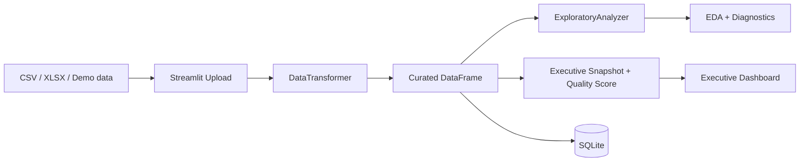

# Data Senior Analytics

[English version](README.en.md)

[](https://github.com/samuelmaia-analytics/data-senior-analytics/actions/workflows/ci.yml)
[](https://codecov.io/gh/samuelmaia-analytics/data-senior-analytics)
[](LICENSE)
[](https://www.python.org/downloads/)

Projeto de analytics desenhado como portfolio de engenharia senior: um dashboard Streamlit que nao apenas mostra graficos, mas orquestra curadoria automatica, profiling, sinais executivos, persistencia SQLite e governanca de deploy.

Demo online: https://data-analytics-sr.streamlit.app

## Tese do Projeto
O problema nao e apenas visualizar dados. O problema real e transformar arquivos tabulares heterogeneos em uma experiencia confiavel para decisao, com qualidade explicita, trilha de transformacao e operacao reproduzivel.

Este repositorio resolve isso com uma abordagem em camadas:
- entrada bruta via CSV/XLSX ou datasets demo
- curadoria automatica com padronizacao, inferencia de tipos, tratamento de nulos e deduplicacao
- politica versionada de scoring e acoes em `config/dashboard_policy.json`
- leitura executiva com KPI, qualidade da base, tendencias e acoes prioritarias
- persistencia do dataset curado em SQLite
- disciplina de engenharia com lint, testes, cobertura, preflight de deploy e rastreabilidade

## Por que este projeto sinaliza senioridade
- Traduz risco tecnico em linguagem de negocio: `Quality Score`, `Completeness`, `Priority actions`.
- Trata Streamlit como camada de produto e operacao, nao como notebook com widgets.
- Separa responsabilidades entre `dashboard/`, `src/analysis/`, `src/data/` e `config/`.
- Extrai a curadoria para um servico reutilizavel em `src/app/curation_service.py`.
- Mantem deploy reproduzivel em Streamlit Cloud com runbook e troubleshooting documentado.
- Usa testes e gates de CI para proteger comportamento e contratos de saida.

## O que o dashboard entrega
- `Overview`: briefing executivo com KPI comerciais, top category, top region, trend de receita e status de qualidade.
- `Upload`: ingestao com curadoria automatica e score de qualidade imediatamente apos a carga.
- `Data`: visao lado a lado de bruto vs curado, perfil de colunas e log do pipeline aplicado.
- `EDA`: insights automatizados, estatisticas, correlacao e missing profile.
- `Visualizations`: distribuicao, business mix e trend analysis.
- `Database`: verificacao operacional do dataset persistido no SQLite.
- `Settings`: metadata de runtime, qualidade e transformacoes aplicadas.

## Fluxo ponta a ponta
1. O usuario carrega um CSV/XLSX ou usa um dataset demo.
2. O app aplica `DataTransformer` para gerar uma versao curada.
3. `ExploratoryAnalyzer` produz estatisticas e insights automatizados.
4. `dashboard/utils/analytics.py` converte esse profiling em uma narrativa executiva.
5. O usuario pode persistir a saida curada em SQLite.

## Decisoes de Arquitetura


Documentacao relacionada:
- [docs/ARCHITECTURE.md](docs/ARCHITECTURE.md)
- [docs/STREAMLIT_CLOUD.md](docs/STREAMLIT_CLOUD.md)
- [docs/DATA_CONTRACT.md](docs/DATA_CONTRACT.md)
- [docs/DATA_LINEAGE.md](docs/DATA_LINEAGE.md)
- [docs/DATA_PROVENANCE.md](docs/DATA_PROVENANCE.md)

## Screenshots / Demo


## Stack
- `streamlit` para experiencia executiva
- `pandas` e `numpy` para transformacao e profiling
- `plotly` para visualizacao analitica
- `sqlite3` via `SQLiteManager` para persistencia
- `ruff`, `black`, `pytest` e `pytest-cov` para disciplina de engenharia

## Execucao local
```bash
git clone https://github.com/samuelmaia-analytics/data-senior-analytics.git
cd data-senior-analytics
python -m venv .venv

# Linux/macOS
source .venv/bin/activate

# Windows PowerShell
.venv\Scripts\Activate.ps1

pip install -r requirements-dev.txt
python -m streamlit run dashboard/app.py
```

## Qualidade e Operacao
- CI com lint, format, testes e coverage.
- Gate de cobertura em `>=70%`.
- Preflight para Streamlit Cloud.
- Checks de encoding, proveniencia e manifest de dados.
- Runtime de deploy alinhado em `Python 3.11`.

## Estrutura do repositorio
- `dashboard/`: interface Streamlit e utilitarios executivos
- `src/analysis/`: analise exploratoria automatizada
- `src/data/`: curadoria, ingestao e persistencia
- `config/`: paths e metadados de execucao
- `docs/`: arquitetura, deploy e governanca
- `tests/`: protecao automatizada de comportamento

## Licenca
Licenciado sob MIT. Veja [LICENSE](LICENSE).
