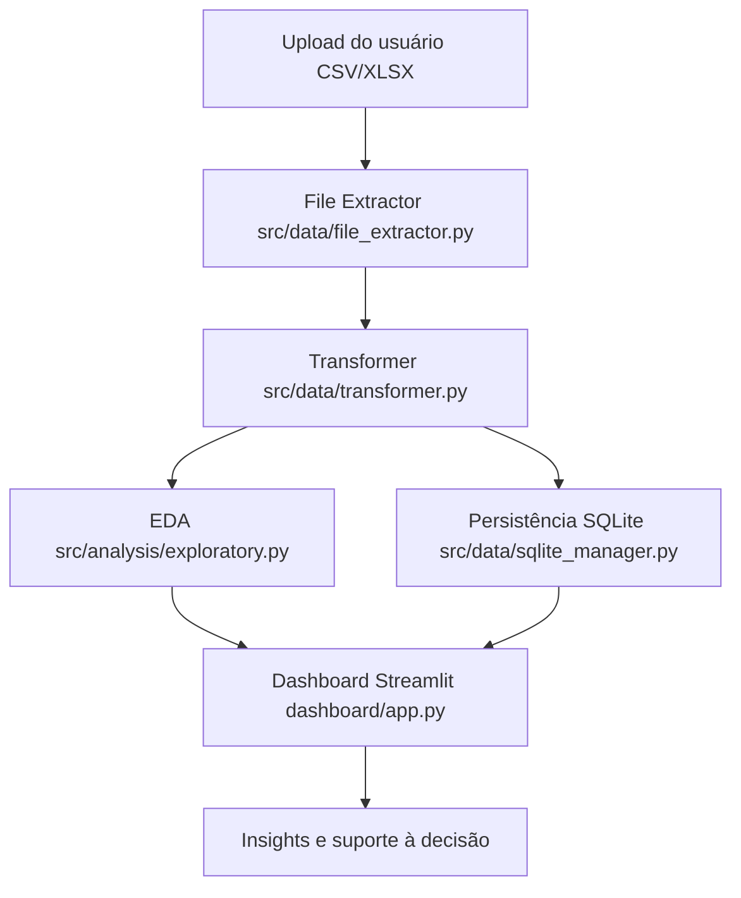
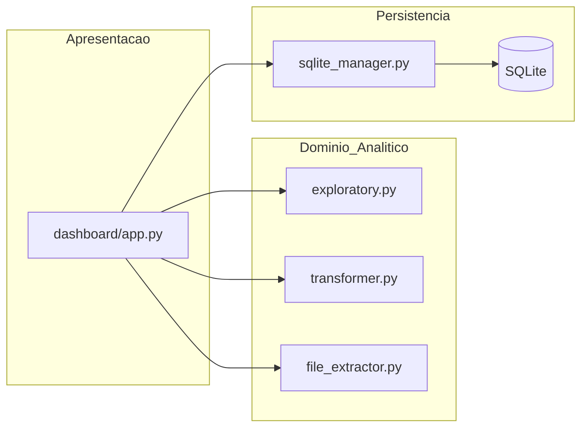

# Data Senior Analytics

[English version](README.en.md)


Aplicação analítica orientada a negócio que transforma dados tabulares brutos em insights acionáveis por meio de análise exploratória, testes estatísticos e dashboard interativo.

Demo online: https://data-analytics-sr.streamlit.app

## Sumário
- [Resumo Executivo](#resumo-executivo)
- [Governança de Dados (Kaggle)](#governança-de-dados-kaggle)
- [Problema de Negócio](#problema-de-negócio)
- [Estratégia de Dados](#estratégia-de-dados)
- [Visão de Arquitetura](#visão-de-arquitetura)
- [Arquitetura Detalhada e ADRs](#arquitetura-detalhada-e-adrs)
- [Estrutura do Projeto](#estrutura-do-projeto)
- [Stack Tecnológica](#stack-tecnológica)
- [Reprodutibilidade (Como Executar)](#reprodutibilidade-como-executar)
- [Deploy no Streamlit Cloud](#deploy-no-streamlit-cloud)
- [Qualidade e Padrão Executivo](#qualidade-e-padrão-executivo)
- [Contato](#contato)
- [Licença](#licença)

## Resumo Executivo
Este projeto representa um fluxo analítico ponta a ponta em nível sênior: ingestão de dados, diagnóstico de qualidade, análise exploratória, validação estatística e comunicação de insights.

Foi estruturado para que recrutadores e líderes técnicos validem rapidamente competências em:
- Análise de dados com visão de negócio
- Engenharia analítica e qualidade de software
- Entrega de valor por produto analítico interativo

## Governança de Dados (Kaggle)
- Fonte oficial do dataset analítico: **Kaggle (dataset real)**
- Dados brutos não são versionados no Git (`data/raw/*` está no `.gitignore`)
- Dados `*_exemplo.csv` são apenas sintéticos para demo local
- Registro de proveniência obrigatório:
  - [docs/DATA_PROVENANCE.md](docs/DATA_PROVENANCE.md)
  - [config/data_source.yaml](config/data_source.yaml)

## Problema de Negócio
Times de negócio frequentemente dependem de planilhas e análises manuais, gerando:
- Baixa velocidade para gerar insights
- Inconsistência na qualidade analítica
- Baixa rastreabilidade da tomada de decisão

A solução propõe uma camada analítica reutilizável em que stakeholders fazem upload dos dados e obtêm rapidamente diagnóstico de qualidade, padrões, relações e tendências.

## Estratégia de Dados
### Fontes de Dados
- Fonte principal: dataset real do Kaggle (registrado em `docs/DATA_PROVENANCE.md`)
- Formatos de entrada: `.csv`, `.xlsx`

### Processamento e Modelagem Analítica
- Extração com tratamento de encoding para ingestão robusta
- Detecção automática de tipos de coluna (numérica, categórica, data, id)
- Diagnóstico de valores ausentes e outliers
- Estatísticas descritivas e análise de correlação
- Testes de hipótese (t-test, ANOVA, qui-quadrado, Pearson, Spearman)
- Persistência opcional em SQLite para reprodutibilidade e reuso

## Visão de Arquitetura




## Arquitetura Detalhada e ADRs
- Arquitetura técnica completa: [docs/ARCHITECTURE.md](docs/ARCHITECTURE.md)
- Registro de decisões arquiteturais:
  - [ADR-0001-streamlit-presentation-layer.md](docs/DECISIONS/ADR-0001-streamlit-presentation-layer.md)
  - [ADR-0002-sqlite-persistence.md](docs/DECISIONS/ADR-0002-sqlite-persistence.md)
  - [ADR-0003-kaggle-provenance-gate.md](docs/DECISIONS/ADR-0003-kaggle-provenance-gate.md)

## Estrutura do Projeto
```text
.
|-- .streamlit/
|   |-- config.toml
|   `-- secrets.example.toml
|-- dashboard/
|   |-- app.py
|   |-- __init__.py
|   `-- utils/
|       |-- analytics.py
|       `-- __init__.py
|-- src/
|   |-- analysis/
|   |   `-- exploratory.py
|   `-- data/
|       |-- file_extractor.py
|       |-- transformer.py
|       `-- sqlite_manager.py
|-- src/utils/
|   `-- observability.py
|-- config/
|   |-- config.yaml
|   |-- data_source.yaml
|   `-- settings.py
|-- scripts/
|   |-- automation.py
|   |-- check_encoding.py
|   |-- generate_sample_data.py
|   |-- set_kaggle_provenance.py
|   |-- streamlit_cloud_preflight.py
|   `-- validate_data_provenance.py
|-- docs/
|   |-- ARCHITECTURE.md
|   |-- DATA_PROVENANCE.md
|   |-- STREAMLIT_CLOUD.md
|   `-- DECISIONS/
|       |-- ADR-0001-streamlit-presentation-layer.md
|       |-- ADR-0002-sqlite-persistence.md
|       `-- ADR-0003-kaggle-provenance-gate.md
|-- data/
|   `-- sample/default_demo.csv
|-- tests/
|-- requirements.txt
|-- requirements-dev.txt
|-- runtime.txt
|-- pyproject.toml
|-- Makefile
|-- README.md
`-- README.en.md
```

## Stack Tecnológica
- Linguagem: Python
- Framework da aplicação: Streamlit
- Processamento de dados: Pandas, NumPy
- Estatística: SciPy
- Visualização: Plotly
- Persistência: SQLite
- Configuração: YAML + camada Python de settings

## Reprodutibilidade (Como Executar)
### Pré-requisitos
- Python 3.11+
- pip

### Execução Local
```bash
git clone https://github.com/samuelmaia-data-analyst/data-senior-analytics.git
cd data-senior-analytics

python -m venv .venv
# Linux/macOS
source .venv/bin/activate
# Windows PowerShell
.venv\Scripts\Activate.ps1

pip install --upgrade pip
pip install -r requirements-dev.txt

# opcional: gerar dataset sintético local para demo
python scripts/generate_sample_data.py

streamlit run dashboard/app.py
```

URL local: http://localhost:8501

## Deploy no Streamlit Cloud
### Configuração recomendada
- Main file path: `dashboard/app.py`
- Python runtime: `runtime.txt`
- Dependências de produção: `requirements.txt`
- Segredos: configurar no painel do Streamlit Cloud com base em `.streamlit/secrets.example.toml`

### Guia operacional
- [docs/STREAMLIT_CLOUD.md](docs/STREAMLIT_CLOUD.md)

## Qualidade e Padrão Executivo
Atalho operacional (`make`):
```bash
make quality
```

Checks individuais:
```bash
python -m ruff check src config scripts dashboard tests
python -m pytest
python scripts/check_encoding.py
python scripts/streamlit_cloud_preflight.py
python scripts/validate_data_provenance.py
```

## Contato
Samuel Maia

Analista de Dados Sênior

LinkedIn: https://linkedin.com/in/samuelmaia-data-analyst

GitHub: https://github.com/samuelmaia-data-analyst

Email: smaia2@gmail.com

## Licença
Este projeto está licenciado sob a licença MIT.
