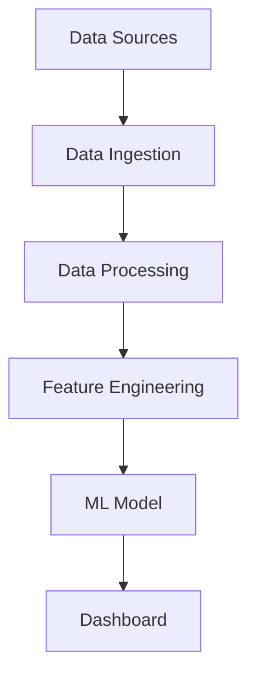

# Data Senior Analytics

[English version](README.en.md)

[](https://github.com/samuelmaia-data-analyst/data-senior-analytics/actions/workflows/ci.yml)
[](https://codecov.io/gh/samuelmaia-data-analyst/data-senior-analytics)
[](LICENSE)
[](https://www.python.org/downloads/)

Projeto de analytics orientado ao negócio que transforma arquivos tabulares brutos em insights prontos para decisão, com pipeline reproduzível e dashboard interativo.

Demo online: https://data-analytics-sr.streamlit.app

## Resumo Executivo
- Problema: equipes dependem de fluxos lentos em planilhas e de análises sem padronização de qualidade.
- Abordagem: pipeline em camadas (`raw -> bronze -> silver -> gold`) com ingestão, transformação, EDA e entrega em dashboard.
- Resultados: repositório de analytics com CI, governança de dados, contratos de saída e execução reproduzível.

## Impacto
- Métricas: a automação de CI aplica lint + format + testes + cobertura (`>=70%`) em todo PR.
- Premissas: entrada em CSV/XLSX vinda de usuários de negócio, com qualidade mista e valores ausentes parciais.
- Resultados: geração de insights mais rápida, com esquema de saída estável para dashboard e stakeholders.

## Impacto no Negócio
- Fonte real: experimento de classificação de inadimplência com dataset Kaggle (`config/data_source.yaml`), registrado em `data/raw/classifica-o-de-inadimpl-ncia.ipynb`.
- Melhor modelo no benchmark: **LightGBM** com **AUC 0,86** e **acurácia 78,38%** (conjunto de teste com 5.015 registros).
- Capacidade de ação: **recall de 76,19%** para a classe inadimplente (1), permitindo identificar cerca de 3 em cada 4 casos de risco.
- Eficiência operacional: **precisão de 79,68%** na classe inadimplente, reduzindo esforço desperdiçado em abordagens de baixo risco.

## Descrição do Dataset
- Fonte:
  - `data/sample/default_demo.csv` (dataset rápido para smoke test)
  - `data/sample/sample_large.csv` (dataset demo mais realista para exploração)
- Linhas:
  - `default_demo.csv`: 12
  - `sample_large.csv`: 240
- Colunas: 9
- Variáveis-chave: `cliente_id`, `valor_total`, `quantidade`, `preco_unitario`, `desconto`, `categoria`, `regiao`
- Como usar no dashboard:
  - a aplicação carrega `default_demo.csv` automaticamente
  - para análise mais robusta, use Upload com `data/sample/sample_large.csv`

## Capturas de Tela / Demo


## Diagrama de Arquitetura


## Evidências de Arquitetura
- Arquitetura em camadas e fluxo: [docs/ARCHITECTURE.md](docs/ARCHITECTURE.md)
- Registro de decisão arquitetural (ADR): [docs/adr/0001-architecture-decision.md](docs/adr/0001-architecture-decision.md)
- Contrato de dados (`raw/bronze/silver/gold`): [docs/DATA_CONTRACT.md](docs/DATA_CONTRACT.md)
- Contrato de scoring de cliente: [contracts/schema_customer.yaml](contracts/schema_customer.yaml)
- Proveniência de dados: [docs/DATA_PROVENANCE.md](docs/DATA_PROVENANCE.md)
- Manifesto de linhagem de dados: [docs/DATA_LINEAGE.md](docs/DATA_LINEAGE.md)

## Recomendações de Negócio
- Priorizar clientes com alta probabilidade de churn
- Executar campanhas de retenção
- Monitorar direcionadores de churn mensalmente

## Decision Playbook
| Decisão | Sinal no dashboard | Quando agir | Ação recomendada |
|---|---|---|---|
| Retenção regional | `churn` estimado por região acima da média | Se uma região ficar >20% por 2 semanas | Campanha tática local com oferta de retenção e revisão de atendimento |
| Reprecificação de desconto | desconto médio sobe e `valor_total` não acompanha | Se desconto médio >10% por 2 ciclos mensais | Recalibrar política comercial e limitar descontos fora de segmentos estratégicos |
| Prioridade de portfólio | queda de receita por categoria | Se uma categoria cair >8% por 3 meses | Reforçar mix de produtos, bundles e ações de cross-sell |
| Qualidade de dados | nulos/duplicados aumentam no upload | Se nulos >3% ou duplicados >1% | Bloquear publicação para diretoria e abrir correção com donos dos dados |
| Risco de concentração | receita concentrada em poucos clientes | Se top 10 clientes >35% da receita | Plano de diversificação de carteira e proteção de contas-chave |

## Decision Framework
- If churn probability > 0.75
  -> Trigger retention campaign
- If churn probability between 0.60-0.75
  -> Offer discount

## Model Monitoring
- drift detection
- prediction distribution
- retraining trigger

## Melhorias Futuras
- detecção de drift de modelo
- retreinamento automatizado
- integração com feature store

## Execução Reproduzível
```bash
git clone https://github.com/samuelmaia-data-analyst/data-senior-analytics.git
cd data-senior-analytics
python -m venv .venv
# Linux/macOS
source .venv/bin/activate
# Windows PowerShell
.venv\Scripts\Activate.ps1

make setup
make lint
make test
make run
```

## Variáveis de Ambiente
Copie `.env.example` para `.env` e ajuste os valores para o seu ambiente.

| Variável | Obrigatória | Finalidade |
|---|---|---|
| `AWS_ACCESS_KEY_ID` | Não | Integração opcional com AWS |
| `AWS_SECRET_ACCESS_KEY` | Não | Integração opcional com AWS |
| `AWS_REGION` | Não | Região AWS (padrão: `us-east-1`) |
| `S3_BUCKET_NAME` | Não | Bucket usado para persistência externa |
| `DATA_PATH` | Não | Raiz de dados local |
| `LOG_LEVEL` | Não | Nível de log da aplicação |

## Qualidade e Engenharia
- `pytest-cov` com gate de cobertura (`>=70%`)
- `ruff` + `black` + `mypy` opcional via pre-commit
- Varredura de segredos e verificação de drift de manifesto no CI
- Testes de contrato de saída Gold em `tests/`

## Gestão de Releases
- Changelog: [CHANGELOG.md](CHANGELOG.md)
- Notas de release: veja [CHANGELOG.md](CHANGELOG.md).

## Licença
Licenciado sob MIT. Veja [LICENSE](LICENSE).
