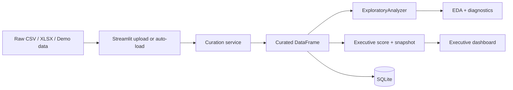
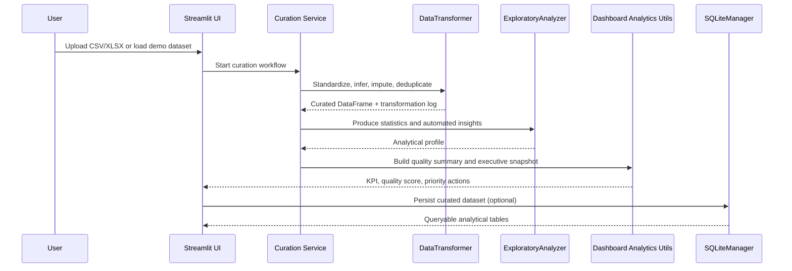

# Architecture

## Executive Summary
The project uses a layered analytics architecture to turn raw tabular inputs into curated, decision-ready outputs. The Streamlit dashboard is the product surface, but the design intentionally separates curation, profiling, executive scoring, persistence, and operational controls.

## Architectural Intent
- Preserve a clean boundary between UI concerns and analytical workflow orchestration.
- Convert data quality into explicit release and decision signals.
- Keep curation reusable outside the dashboard.
- Make deployment and governance first-class parts of the system.

## Layers
- Presentation layer: `dashboard/app.py` renders the executive interface, KPI surfaces, EDA tabs, and persistence actions.
- Dashboard analytics layer: `dashboard/utils/analytics.py` translates profiling into quality score, priority actions, executive snapshot, and correlation summaries.
- Application service layer: `src/app/curation_service.py` orchestrates curation, profiling, scoring, and executive metadata generation.
- Domain analytics layer: `src/analysis/exploratory.py` generates descriptive statistics and automated insights.
- Data curation layer: `src/data/transformer.py` standardizes column names, infers types, handles missing values, and removes duplicates.
- Persistence layer: `src/data/sqlite_manager.py` stores curated outputs in SQLite for downstream inspection and reuse.
- Platform/config layer: `config/settings.py`, `config/dashboard_policy.json`, `.streamlit/`, and validation scripts define runtime paths, scoring policies, deployment expectations, and governance checks.

## End-to-End Flow

## Runtime Sequence

## Dashboard Operating Model
- `Overview`: executive KPI, quality status, board briefing, commercial concentration, and trend view.
- `Upload`: raw-to-curated transition with immediate quality feedback.
- `Data`: raw vs. curated inspection, column profile, and transformation log.
- `EDA`: automated insights, descriptive statistics, missing profile, and strongest correlations.
- `Visualizations`: distribution analysis, business mix, and time trend exploration.
- `Database`: operational confirmation of persisted curated data.
- `Settings`: runtime metadata, quality metadata, and transformation count.

## Engineering Controls
- CI gate: lint, format, tests, and coverage (`>=70%`).
- Streamlit Cloud preflight and runtime runbook in [STREAMLIT_CLOUD.md](STREAMLIT_CLOUD.md).
- Structured logs with `trace_id` and per-page elapsed time.
- Manifest and provenance checks to reduce silent data drift.
- Smoke tests that render dashboard pages in CI.
