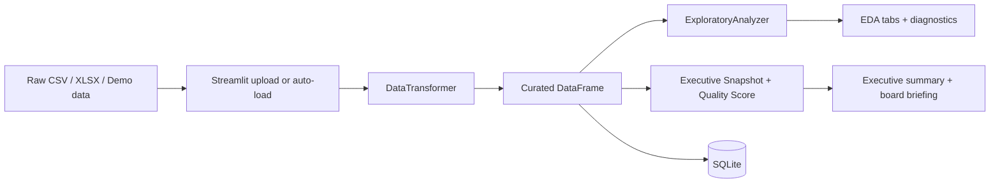
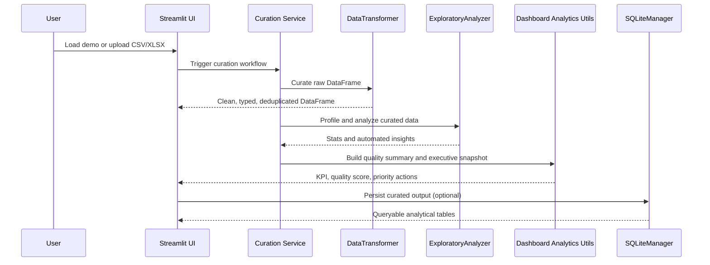

# Architecture

## Executive Summary
The project follows a layered analytics architecture that separates business presentation, curation logic, exploratory analysis, and persistence. The dashboard is not only a UI shell: it orchestrates a governed path from raw upload to curated, decision-ready output.

## Layers
- Presentation layer: `dashboard/app.py` renders the executive experience, KPI cards, EDA tabs, and persistence flows.
- Dashboard analytics layer: `dashboard/utils/analytics.py` converts technical profiling into executive metrics such as quality score, priority actions, and board-ready snapshots.
- Application service layer: `src/app/curation_service.py` orchestrates curation, profiling, scoring, and executive snapshot generation.
- Domain analytics layer: `src/analysis/exploratory.py` produces descriptive statistics and automated insights.
- Data curation layer: `src/data/transformer.py` standardizes columns, infers types, treats missing values, and removes duplicates.
- Persistence layer: `src/data/sqlite_manager.py` stores curated datasets in SQLite for downstream querying.
- Platform/config layer: `config/settings.py`, `config/dashboard_policy.json`, `.streamlit/`, and validation scripts define runtime paths, scoring policy, deployment guardrails, and governance checks.

## End-to-End Flow

## Runtime Sequence

## Dashboard Operating Model
- `Overview`: executive KPI, quality status, board briefing, top category, top region, revenue trend.
- `Upload`: raw-to-curated flow, quality gate visibility, and persistence to SQLite.
- `Data`: curated preview, raw preview, column profile, and transformation log.
- `EDA`: insights, statistics, missing profile, and strongest correlations.
- `Visualizations`: distribution, business mix, and trend analysis.
- `Database`: operational verification of persisted analytical tables.
- `Settings`: runtime metadata, quality metadata, and transformation count.

## Engineering Discipline
- CI gate: lint + format + tests + coverage (`>=70%`).
- Streamlit Cloud preflight and deployment runbook in `docs/STREAMLIT_CLOUD.md`.
- Structured logs with `trace_id` and per-page elapsed time.
- Data provenance and manifest checks to prevent silent drift.
- ADRs to document major architectural decisions.
